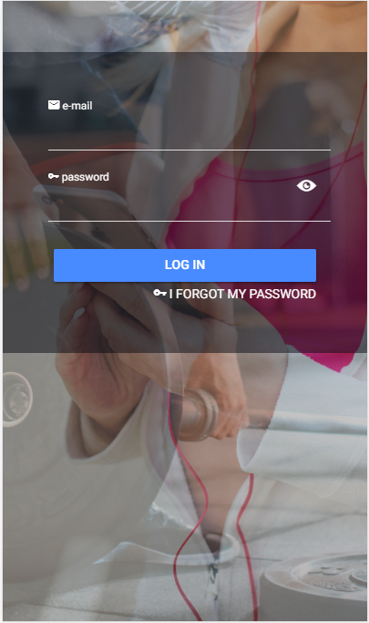
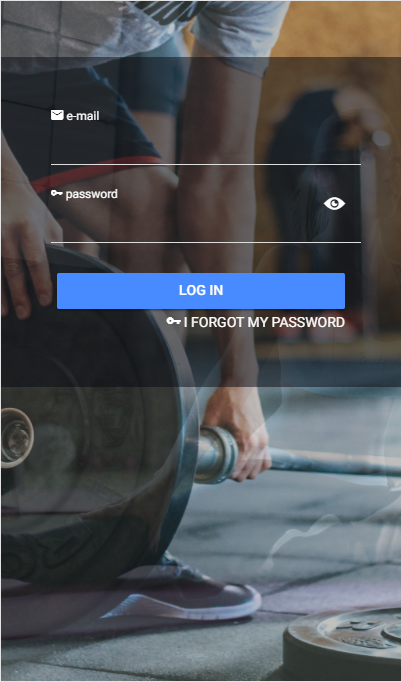
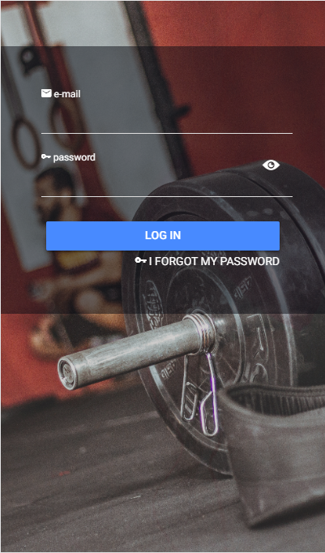
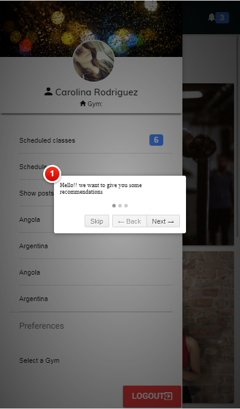
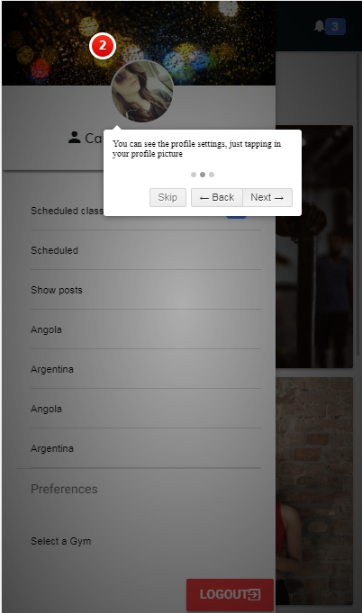
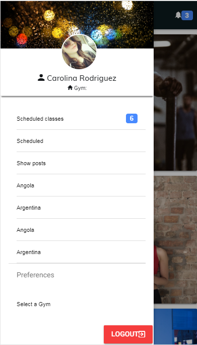
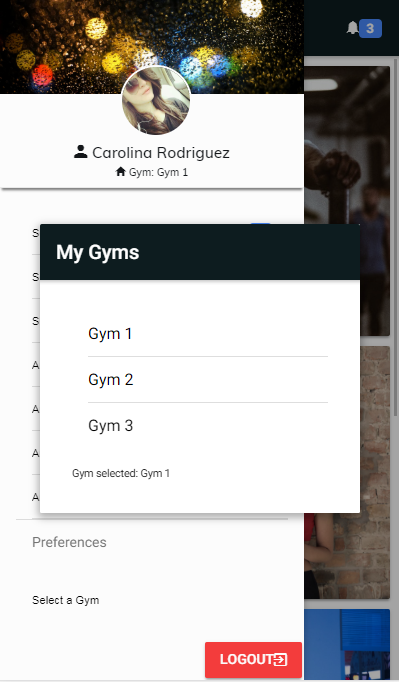

# Fitness-App

This is just a basic ionic app, to show fitness stuff. Right now there is only de structure of the app.

## Getting Started

git clone https://github.com/CarlosTheory/fitnessApp-ionic.git
cd fitnessApp-ionic
npm install
ionic serve

### Prerequisites

What things you need?
node
npm
ionic 4.0.4
javac 1.8.0_181

## Screenshots

## Built With

* [Ionic](https://ionicframework.com/) - Build amazing apps in one codebase, for any platform, with the web.

